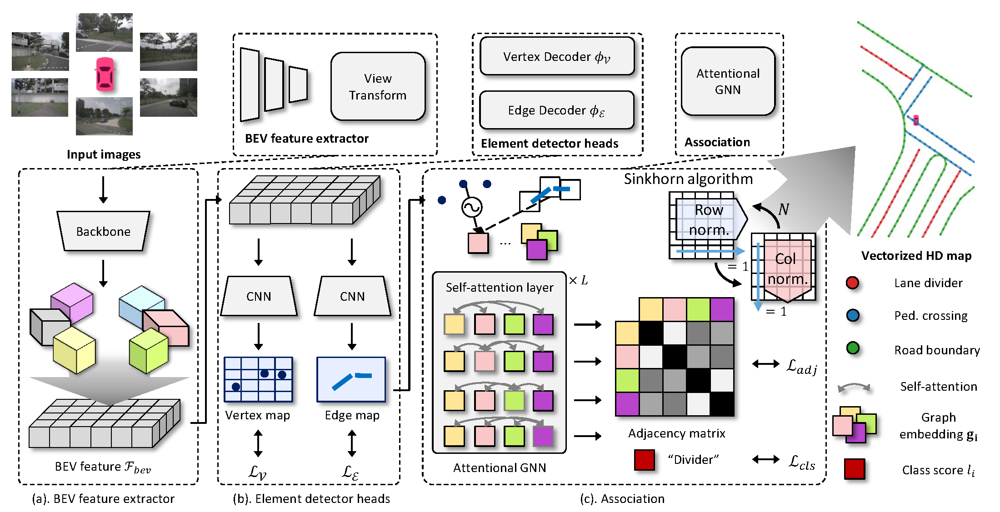
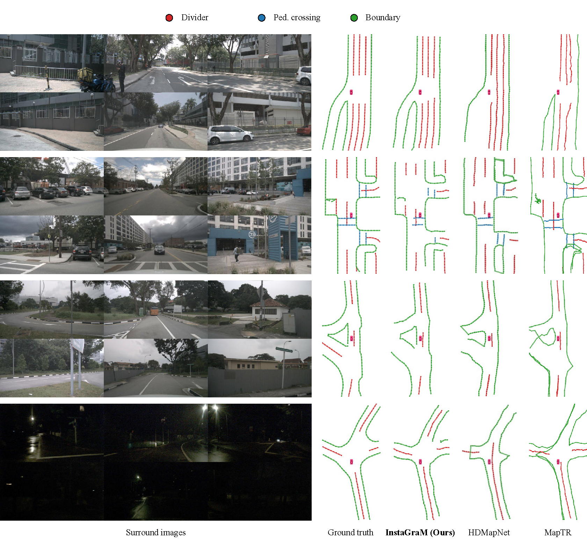

<div align="center">
<h1> InstaGraM</h1>
<h3><ins>Insta</ins>nce-level <ins>Gra</ins>ph <ins>M</ins>odeling for Vectorized HD Map Learning</h3>

[Juyeb Shin](https://scholar.google.com/citations?user=6S5WRYMAAAAJ&hl=en&oi=sra)<sup>1</sup> , [François Rameau](https://scholar.google.com/citations?user=Hfx_pykAAAAJ&hl=en&oi=sra)<sup>2</sup> , [Hyeonjun Jeong](https://scholar.google.com/citations?user=kqCABNMAAAAJ&hl=en&oi=sra)<sup>3</sup> , [Dongsuk Kum](https://scholar.google.com/citations?user=5DUOqDwZ97gC&hl=en&oi=sra)<sup>3 :email:</sup>

<sup>1</sup> The Robotics Program, KAIST, <sup>2</sup> Computer Science department, SUNY - Korea, <sup>3</sup> Graduate School of Mobility, KAIST

(<sup>:email:</sup>) corresponding author.

ArXiv Preprint ([arXiv 2301.04470](https://arxiv.org/abs/2301.04470))

[VCAD Workshop @ CVPR'23](https://vcad.site/papers/5/CameraReady/paper.pdf)
</div>

## Introduction

For scalable autonomous driving, a robust map-based localization system, independent of GPS, is fundamental. To achieve such map-based localization, online high-definition (HD) map construction plays a significant role in accurate estimation of the pose.
% High-definition (HD) map detection plays a significant role in ensuring the accuracy of such map-based localization. Although recent advancements in online HD map construction have predominantly investigated on vectorized representation due to its effectiveness, they suffer from computational cost and fixed parametric model, which limit scalability. To alleviate these limitations, we propose a novel HD map learning framework that leverages graph modeling. This framework is designed to learn the construction of diverse geometric shapes, thereby enhancing the scalability of HD map construction. Our approach involves representing the map elements as an instance-level graph by decomposing them into vertices and edges to facilitate accurate and efficient end-to-end vectorized HD map learning. Furthermore, we introduce an association strategy using a Graph Neural Network to efficiently handle the complex geometry of various map elements, while maintaining scalability. Comprehensive experiments on public open dataset show that our proposed network outperforms state-of-the-art model by $0.9$ mAP with up to $1.4\times$ faster computation time. We further showcase the superior scalability of our approach compared to state-of-the-art methods, achieving a $11.2$ mAP improvement in long range configuration.

## Models
<div align="center"><h4> nuScenes dataset</h4></div>

> Results from paper in IEEE journal format (paper to be released soon)

| Method | Image Size | Backbone | Epoch | mAP | FPS |
| :---: | :---: | :---: | :---: | :---: | :---: |
| InstaGraM | 128 $\times$ 352 | Effi-B0 | 30 | 35.9 | 24.8 | 
| InstaGraM | 128 $\times$ 352 | Effi-B4 | 30 | 41.9 | 19.2 |
| InstaGraM | 256 $\times$ 704 | Effi-B4 | 30 | 47.8 | 11.8 |

**Notes**: 

- FPS is measured on NVIDIA RTX3090 GPU with batch size of 1 (containing 6 view images).
- All the experiments are performed on 4 NVIDIA GeForce RTX 3090 GPUs. 

> Results from this repo (single GPU training)

### Models and Logs

| Method | Image Size | Backbone | View Transform | Epoch | mAP | FPS | Download |
| :---: | :---: | :---: | :---: | :---: | :---: | :---: | :---: |
| InstaGraM | 128 $\times$ 352 | Effi-B4 | LSS | 30 | - | - | [model]() / [log]()
| InstaGraM | 256 $\times$ 704 | Effi-B4 | LSS | 30 | - | - | [model]() / [log]()

## Comparison


## Getting Started
### Installation
1. Download [nuScenes dataset](https://www.nuscenes.org/) and put it to `./nuscenes/` folder. We recommand using symbolic link.

2. Create conda environment
```shell
conda create -n instagram python=3.8 -y
conda activate instagram
```

3. Install PyTorch
```shell
pip install torch==1.10.2+cu113 torchvision==0.11.3+cu113 torchaudio==0.10.2+cu113 -f https://download.pytorch.org/whl/torch_stable.html
```

1. Install PyTorch-Scatter
```shell
pip install torch-scatter -f https://data.pyg.org/whl/torch-1.10.2+cu113.html
```

1. Install dependencies by running
```shell
pip install -r requirement.txt
```

### Label
Run `python vis_label.py` for demo of vectorized labels. The visualizations will be saved in `./nuscenes/samples/GT`.

### Training
Run `python train.py --logdir [output dir] --distance_reg --version [v1.0-trainval, v1.0-mini]`. For additional model architecture, please refer to our [model logs](#models-and-logs).

### Evaluation
Run `python export_pred_to_json.py --modelf [checkpoint]` to get submission file for trained model and evaluation metrics.

## Acknowledgements
InstaGraM is built on great baseline [HDMapNet](https://github.com/Tsinghua-MARS-Lab/HDMapNet). It is also inspired by the following outstanding contributions: [Lift-Splat-Shoot](https://github.com/nv-tlabs/lift-splat-shoot), [SuperPoint](https://github.com/magicleap/SuperPointPretrainedNetwork), [SuperGlue](https://github.com/magicleap/SuperGluePretrainedNetwork).

## Citation
If you found this useful in your research, please consider citing
```
@misc{shin2023instagram,
      title={InstaGraM: Instance-level Graph Modeling for Vectorized HD Map Learning}, 
      author={Juyeb Shin and Francois Rameau and Hyeonjun Jeong and Dongsuk Kum},
      year={2023},
      eprint={2301.04470},
      archivePrefix={arXiv},
      primaryClass={cs.CV},
      url={https://arxiv.org/abs/2301.04470}, 
}
```